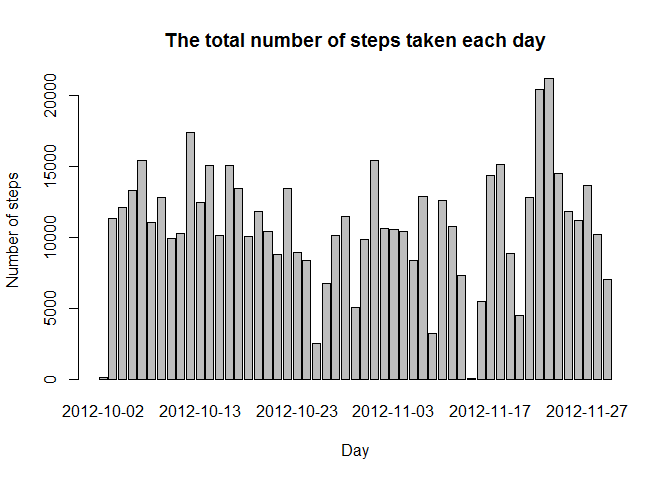
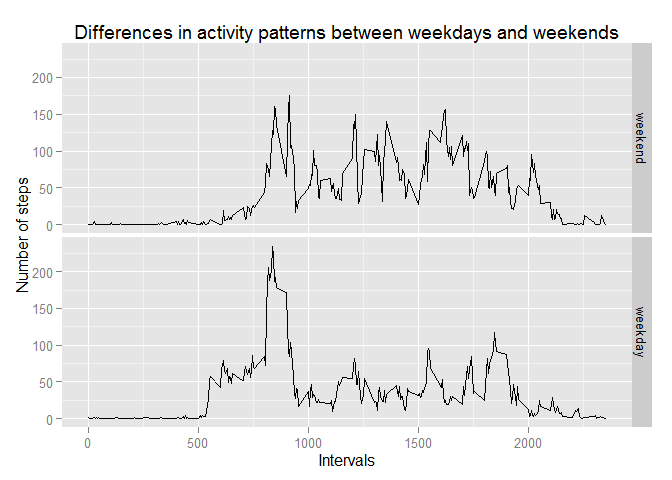

# Reproducible Research: Peer Assessment 1


## Loading and preprocessing the data


```r
## Load the data 
library(data.table)
DT <- fread("activity.csv")
DT[, date := as.Date(date)]
```

## What is mean total number of steps taken per day?


```r
## Calculate the total number of steps taken per day
total_steps_per_day <- DT[!is.na(steps)][, sum(steps, na.rm = TRUE), 
                                         by = date]
names(total_steps_per_day)[2] <- "steps"

## Make a histogram of the total number of steps taken each day
barplot(total_steps_per_day$steps, names.arg = total_steps_per_day$date, 
        main = "The total number of steps taken each day",
        xlab = "Day", ylab = "Number of steps")
```

 


```r
## Calculate the mean and median total number of steps taken per day
mean_steps_per_day <- mean(total_steps_per_day$steps) 
median_steps_per_day <- median(total_steps_per_day$steps) 
```

The mean total number of steps taken per day is **10766.1887**  
The median total number of steps taken per day is **10765**

## What is the average daily activity pattern?


```r
## Calculate the 5-minute interval and the average number of steps taken, 
## averaged across all days
average_steps_per_interval_na <- DT[!is.na(steps)][, mean(steps, na.rm = TRUE), 
                                                   by = interval]
names(average_steps_per_interval_na)[2] <- "steps"

## Make a time series plot 
plot(average_steps_per_interval_na$interval, average_steps_per_interval_na$steps, 
     type = "l",
     xlab = "Interval", ylab = "Number of steps", 
     main = "The average number of steps taken, averaged across all days" )
```

 


```r
## Calculate the maximum 5-minute interval, on average across all the days 
## in the dataset, that contains the maximum number of steps
maximum_steps_interval <- average_steps_per_interval_na[, .SD[which.max(steps)]]
```
The maximum 5-minute interval, on average across all the days in the dataset, that contains the maximum number of steps is **835** with **206.1698113** steps

## Imputing missing values


```r
## Calculate the total number of missing values in the dataset
missing_values <- sum(is.na(DT$steps))
```
The total number of missing values in the dataset is **2304**  
The median value is used for missing values 

```r
## Create a new dataset that is equal to the original dataset but with 
## the missing data filled in
total_steps_per_day_with_na2 <- DT[, sum(steps), by = date]
names(total_steps_per_day_with_na2)[2] <- "steps"
## Use median for missing values
total_steps_per_day_with_na2[is.na(steps)]$steps <- median_steps_per_day
## Make a histogram of the total number of steps taken each day 
barplot(total_steps_per_day_with_na2$steps, 
        names.arg = total_steps_per_day_with_na2$date,
        xlab = "Day", ylab = "Number of steps",
        main = "The average number of steps taken, averaged across all days \n\r(missing data filled in with median)")
```

 


```r
## Calculate the mean and median total number of steps taken per day
mean_steps_per_day2 <- mean(total_steps_per_day_with_na2$steps)
median_steps_per_day2 <- median(total_steps_per_day_with_na2$steps)
```

The mean total number of steps taken per day is **10766.0328**.  
The median total number of steps taken per day is **10765**.

**The strategy of filling in the missing data with median does not impact on the estimates of the total daily number of steps.**

## Are there differences in activity patterns between weekdays and weekends?


```r
## Create a new factor variable in the dataset with two levels – “weekday” 
## and “weekend” indicating whether a given date is a weekday or weekend day
weekdays1 <- c('Monday', 'Tuesday', 'Wednesday', 'Thursday', 'Friday')

DT[,wDay := factor((weekdays(date) %in% weekdays1), 
                   levels=c(FALSE, TRUE), labels=c('weekend', 'weekday')) ]
average_steps_per_day_na_w <- DT[!is.na(steps)][, mean(steps, na.rm = TRUE), 
                                                by = .(interval, wDay) ]
names(average_steps_per_day_na_w)[3] <- "steps"
## Make a panel plot containing a time series plot (i.e. type = "l") 
## of the 5-minute interval and the average number of steps taken, averaged 
## across all weekday days or weekend days 
library(ggplot2)
qplot(interval, steps, data = average_steps_per_day_na_w, geom = "line", 
      facets = wDay~ ., xlab = "Intervals", ylab = "Number of steps",
      main = "Differences in activity patterns between weekdays and weekends")
```

 
